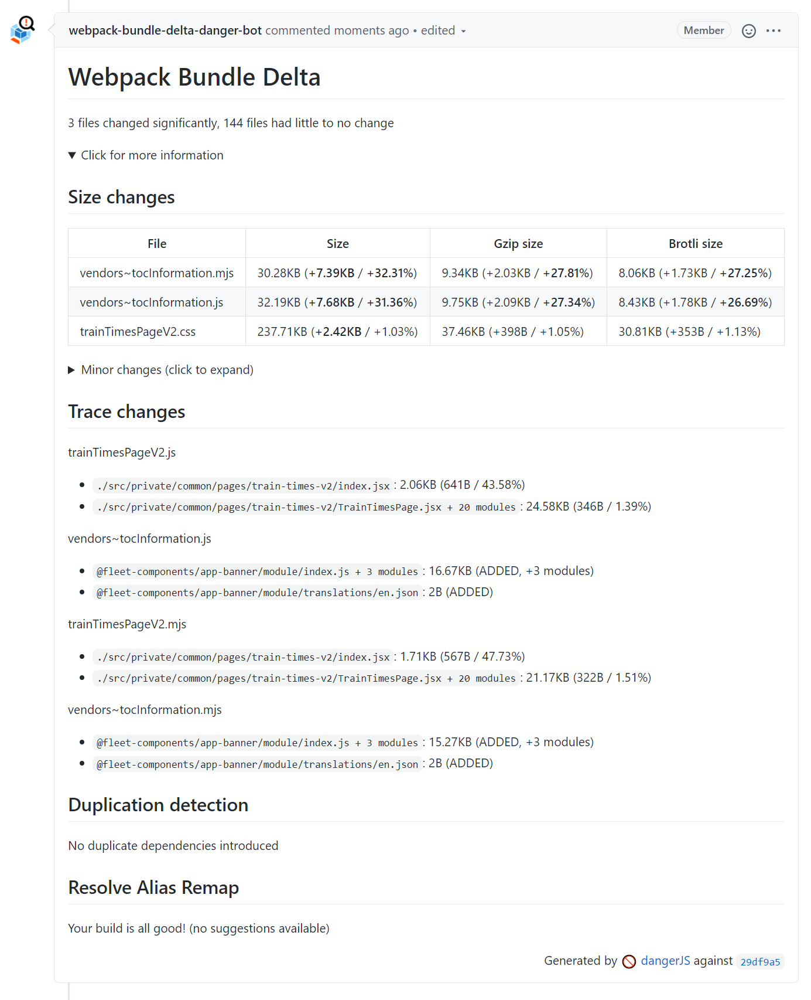

# webpack-bundle-delta

[](https://github.com/trainline/webpack-bundle-delta/actions?query=workflow%3A%22Node.js+CI%22)

<p align="center">
  
</p>

<p align="center">
  Get insights into your <strong>webpack v4</strong> bundles as early as possible.
</p>

Features:
- See [webpack chunk](https://webpack.js.org/guides/code-splitting/) deltas (size, gzip size, and brotli size)
- Computes the delta for pull requests between [base and head](https://docs.github.com/en/github/collaborating-with-issues-and-pull-requests/changing-the-base-branch-of-a-pull-request)
- Surface the relevant information to pull requests via [dangerjs](https://danger.systems/js/)
- Plugin system allows extending with more features as we improve our knowledge on how to better optimise our bundles

Why?
- Performance is crucial to any website
- Understanding the changes that occur in applications as early as possible ensures that any unforeseen changes don't make it to production
- Automates steps that the performance team manually were doing earlier

**Check out the [docs folder](docs) for more details, including [architecture design](docs/architecture.md).**

*Note: this tool is still in its infancy and we welcome [contributions](CONTRIBUTING.md) to make it better.*

## Usage

1. [Gather webpack bundle stats](./docs/gather-webpack-stats.md)
2. [Produce compressed output of your files](./docs/compression-output.md)
3. Install via `yarn` or `npm`
    ``` console
    yarn add webpack-bundle-delta --dev
    # or
    npm i -D webpack-bundle-delta
    ```
4. [Optionally] [configure](./src/config/README.md) `webpack-bundle-delta` to your needs
5. Follow either the `cli` or `dangerjs` setup below
6. Enjoy the stats!

### CLI

CLI can be used if you wish to simply see the results as part of your build.

As an example, to compare 2 compilation stats JSON files, you could do the following

``` bash
$ webpack-bundle-delta local ./path-to/base-stats.json ./path-to/head-stats.json
```

Which would result in a similar output to the below
```
# Webpack Bundle Delta

3 files changed significantly, 144 files had little to no change

## Size changes

### Significant changes

| File                       |             Size            |         Gzip size          |         Brotli size        |
| :------------------------- | :-------------------------: | :------------------------: | :------------------------: |
| vendors~tocInformation.mjs | 30.28KB (+7.39KB / +32.31%) | 9.34KB (+2.03KB / +27.81%) | 8.06KB (+1.73KB / +27.25%) |
| vendors~tocInformation.js  | 32.19KB (+7.68KB / +31.36%) | 9.75KB (+2.09KB / +27.34%) | 8.43KB (+1.78KB / +26.69%) |
| trainTimesPageV2.css       | 237.71KB (+2.42KB / +1.03%) |  37.46KB (+398B / +1.05%)  |  30.81KB (+353B / +1.13%)  |

### Minor changes

| File                                |            Size           |         Gzip size         |        Brotli size        |
| :---------------------------------- | :-----------------------: | :-----------------------: | :-----------------------: |
| trainTimesPageV2.mjs                | 565.71KB (+347B / +0.06%) |  150.4KB (-431B / -0.28%) |  118.66KB (+69B / +0.06%) |
| trainTimesPageV2.js                 | 623.43KB (+370B / +0.06%) |  162.1KB (-22B / -0.01%)  |  124.97KB (+10B / +0.01%) |
| intl.js                             |            80B            |             -             |             -             |
| intl.mjs                            |            80B            |             -             |             -             |
| locale-data-fr.js                   |          11.08KB          |           1.8KB           |           1.54KB          |
| locale-data-fr.mjs                  |          10.71KB          |           1.61KB          |           1.38KB          |

<truncated as the table gets quite long>

## Trace changes

trainTimesPageV2.js

- ./src/private/common/pages/train-times-v2/index.jsx: 2.06KB (641B / 43.58%)
- ./src/private/common/pages/train-times-v2/TrainTimesPage.jsx + 20 modules: 24.58KB (346B / 1.39%)

vendors~tocInformation.js

- @fleet-components/app-banner/module/index.js + 3 modules: 16.67KB (ADDED, +3 modules)
- @fleet-components/app-banner/module/translations/en.json: 2B (ADDED)

trainTimesPageV2.mjs

- ./src/private/common/pages/train-times-v2/index.jsx: 1.71KB (567B / 47.73%)
- ./src/private/common/pages/train-times-v2/TrainTimesPage.jsx + 20 modules: 21.17KB (322B / 1.51%)

vendors~tocInformation.mjs

- @fleet-components/app-banner/module/index.js + 3 modules: 15.27KB (ADDED, +3 modules)
- @fleet-components/app-banner/module/translations/en.json: 2B (ADDED)


## Duplication detection

No duplicate dependencies introduced


## Resolve Alias Remap

Your build is all good! (no suggestions available)
Done in 2.83s.
```

Use `webpack-bundle-delta -h` to see what options are available:
- `base` and `head` sha need to be manually specified if the data sources require it

### Danger JS file (Pull request integration)

Whilst being able to see the output in build log files is great, surfacing the information up to pull requests makes it clear for developers and reviews as to the impact of their changes.

[Danger js](https://danger.systems/js/) is a great tool for helping consumers (and plugins) add information to pull requests (and provides a lot of flexibility such as ability to use it with other code repositories other than GitHub).

Given that, if you have not set up Danger, that would be the first step. Once you've done that, in your `dangerfile.js` import the danger setup, and an appropriate data source.

``` javascript
import { danger, TeamCityDataSource } from 'webpack-bundle-delta';

// ... other danger rules

delta({
  dataSource: new TeamCityDataSource({
    // data source options
  }),
  baseSha: danger.github.pr.base.sha,
  headSha: danger.github.pr.head.sha,
});
```

Which would result in a PR comment


And when expanded


